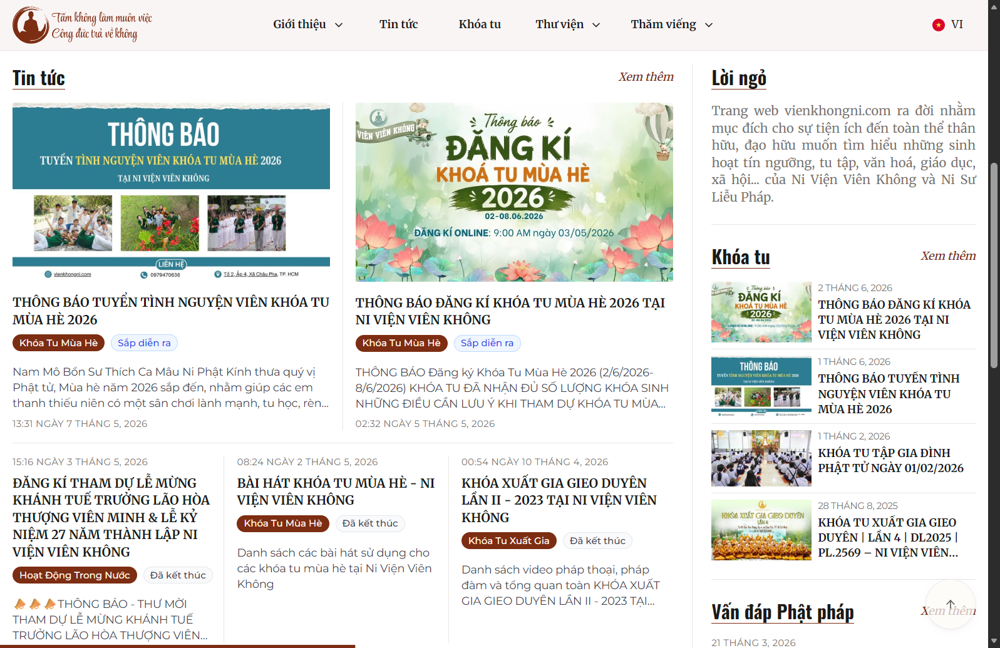
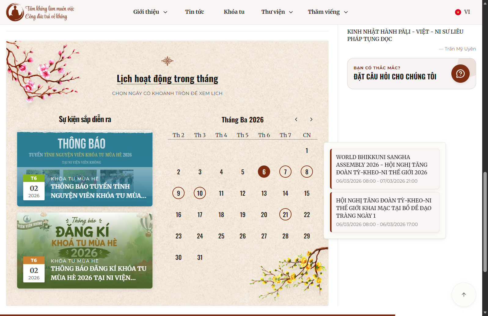
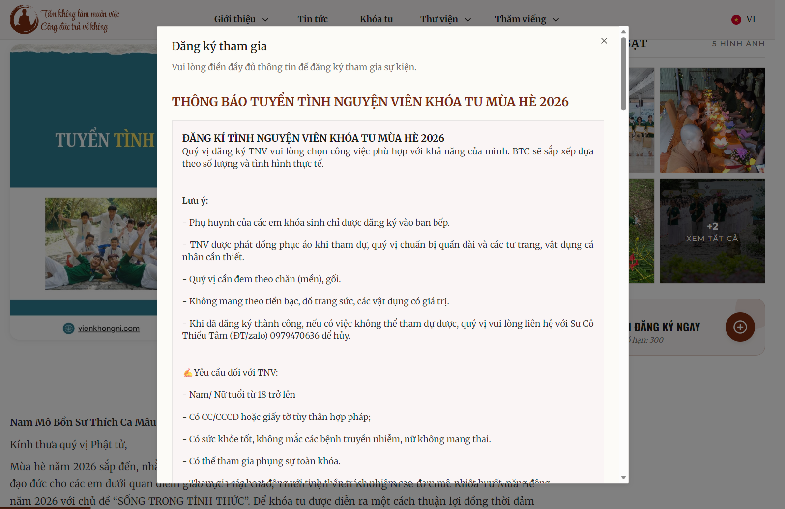
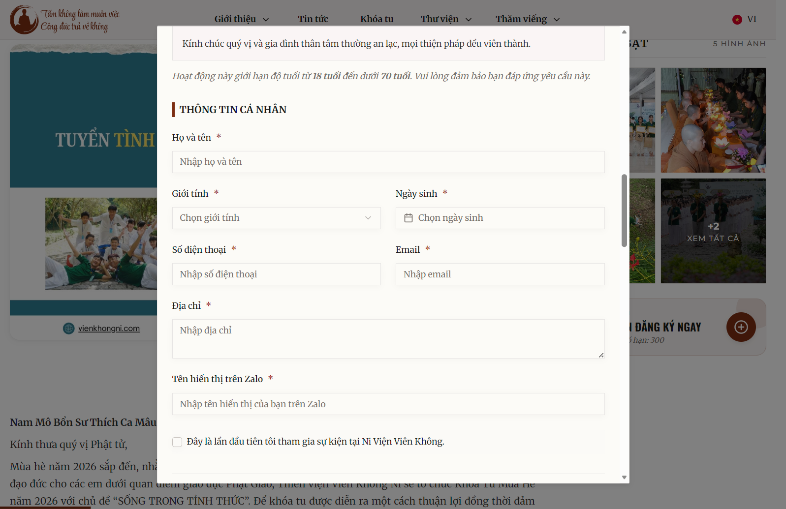
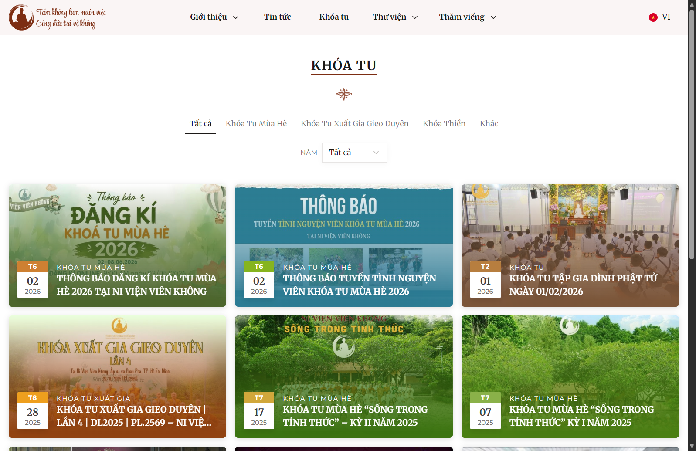

# ni-vien-vien-khong-frontend

Trang web chính thức của Ni Viện Viên Không, được xây dựng nhằm hỗ trợ thân hữu và đạo hữu dễ dàng tiếp cận các thông tin về sinh hoạt tín ngưỡng, tu tập, văn hoá, giáo dục và hoạt động cộng đồng của Ni Viện Viên Không cùng Ni Sư Liễu Pháp.

Website cho phép người dùng:

- Theo dõi các hoạt động và thông báo của Ni viện
- Tìm hiểu thông tin về tu tập, văn hoá và giáo dục
- Đăng ký tham gia khóa tu và các chương trình sinh hoạt
- Gửi câu hỏi và nhận phản hồi
- Cập nhật tin tức và lịch hoạt động mới nhất

Dự án tập trung vào trải nghiệm người dùng thân thiện, giao diện dễ sử dụng và khả năng quản lý nội dung linh hoạt.

## Demo

- Live: https://www.vienkhongni.com/








## Tech Stack


## Installation

### Clone repo

```bash
git clone https://github.com/hquangthinh13/ni-vien-vien-khong-frontend.git

cd project
```

### Install dependencies

```bash
npm install
```

## Environment Variables

```env
NEXT_PUBLIC_STRAPI_API_TOKEN=YOUR_STRAPI_API_TOKEN
NEXT_PUBLIC_STRAPI_URL=YOUR_STRAPI_URL
NEXT_PUBLIC_RECAPTCHA_SITE_KEY=YOUR_RECAPTCHA_SITE_KEY
```

## Run Project

### Development

```bash
npm run dev
```

### Production

```bash
npm run build
npm start
```

## Deployment


