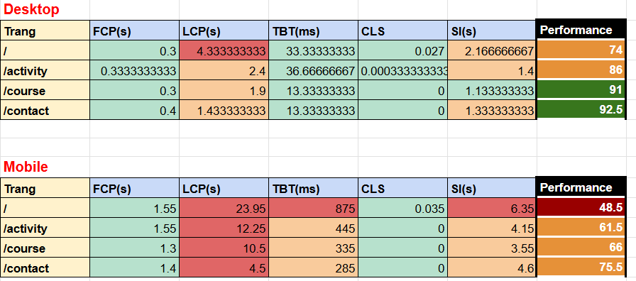

# Performance Baseline Report

Dự án: VienKhongNi Frontend

---

# 1. Mục tiêu

Tài liệu này ghi lại **baseline performance** của các trang chính trong hệ thống trước khi thực hiện các hoạt động tối ưu hoặc load testing.

Baseline performance giúp:

* Hiểu hiệu năng hiện tại của hệ thống
* So sánh với các lần đo sau khi tối ưu
* Làm cơ sở cho các hoạt động performance testing tiếp theo

---

# 2. Môi trường kiểm thử

| Thuộc tính      | Giá trị              |
| --------------- | -------------------- |
| Tool            | Lighthouse           |
| Browser         | Google Chrome        |
| Mode            | Navigation           |
| Environment     | Localhost            |
| Số lần chạy     | 3 lần / mỗi trang    |
| Giá trị sử dụng | Trung bình (average) |

---

# 3. Các trang được kiểm thử

Các trang chính được đo performance:

```
/
/activity
/course
/contact
```

---

# 4. Các chỉ số được đo

| Metric                         | Ý nghĩa                                    |
| ------------------------------ | ------------------------------------------ |
| FCP (First Contentful Paint)   | Thời gian nội dung đầu tiên xuất hiện      |
| LCP (Largest Contentful Paint) | Thời gian phần tử nội dung lớn nhất render |
| TBT (Total Blocking Time)      | Thời gian JavaScript block main thread     |
| CLS (Cumulative Layout Shift)  | Độ ổn định layout                          |
| SI (Speed Index)               | Tốc độ hiển thị nội dung của trang         |
| Performance Score              | Điểm tổng hợp của Lighthouse               |

---

# 5. Kết quả đo – Desktop

| Trang     | FCP (s) | LCP (s) | TBT (ms) | CLS    | SI (s) | Performance |
| --------- | ------- | ------- | -------- | ------ | ------ | ----------- |
| /         | 0.3     | 4.33    | 33.33    | 0.027  | 2.17   | 74          |
| /activity | 0.33    | 2.4     | 36.66    | 0.0003 | 1.4    | 86          |
| /course   | 0.3     | 1.9     | 13.33    | 0      | 1.13   | 91          |
| /contact  | 0.4     | 1.43    | 13.33    | 0      | 1.33   | 92.5        |

---

# 6. Kết quả đo – Mobile

| Trang     | FCP (s) | LCP (s) | TBT (ms) | CLS   | SI (s) | Performance |
| --------- | ------- | ------- | -------- | ----- | ------ | ----------- |
| /         | 1.55    | 23.95   | 875      | 0.035 | 6.35   | 48.5        |
| /activity | 1.55    | 12.25   | 445      | 0     | 4.15   | 61.5        |
| /course   | 1.3     | 10.5    | 335      | 0     | 3.55   | 66          |
| /contact  | 1.4     | 4.5     | 285      | 0     | 4.6    | 75.5        |

---


# 7. Đánh giá ban đầu

### Desktop

* Hiệu năng tổng thể khá tốt.
* Hầu hết các trang đạt **Performance > 85**.
* Trang homepage có **LCP cao hơn khuyến nghị** (~4.3s), cho thấy phần tử nội dung lớn nhất tải chậm hơn các trang khác.

### Mobile

* Hiệu năng thấp hơn đáng kể so với desktop.
* LCP và TBT cao trên nhiều trang, đặc biệt là trang homepage.
* Điều này cho thấy hệ thống có thể bị ảnh hưởng bởi:

  * tài nguyên lớn
  * JavaScript blocking
  * tải nội dung chính chậm trên thiết bị di động.

---

# 8. Kết luận

* Hệ thống hiển thị nội dung ban đầu khá nhanh (FCP thấp).
* Layout ổn định (CLS thấp).
* Tuy nhiên, **LCP và TBT trên mobile còn cao**, cho thấy cần phân tích sâu hơn trong các bước performance testing tiếp theo.

Các kết quả trên được sử dụng làm **baseline performance** cho dự án.

---

# 9. Công việc tiếp theo

Các bước tiếp theo trong Epic Performance Testing:

1. Phân tích bottleneck performance
2. Thực hiện API performance testing
3. Load testing với nhiều user
4. Stress testing hệ thống
5. So sánh kết quả với baseline
